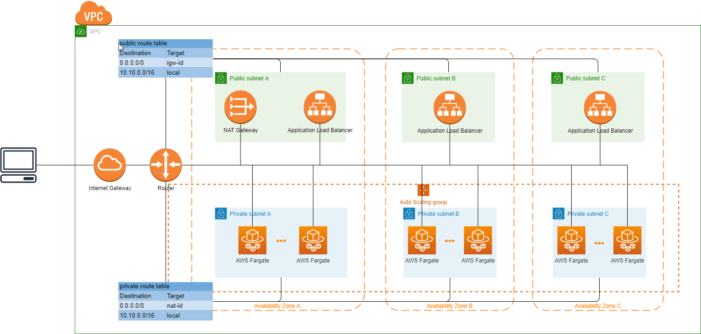

## Description

[AWS ECS Fargate](https://github.com/nestjs/nest) example repository.
[Nest](https://github.com/nestjs/nest) framework TypeScript starter project.

## Pre-request

node version: 18.0.0

```bash
$ brew install asdf
$ echo -e "\n. $(brew --prefix asdf)/libexec/asdf.sh" >> ~/.bash_profile
$ echo -e "\n. $(brew --prefix asdf)/etc/bash_completion.d/asdf.bash" >> ~/.bash_profile
$ source ~/.bash_profile
$ asdf plugin add nodejs https://github.com/asdf-vm/asdf-nodejs.git
$ asdf list all nodejs
$ asdf install nodejs 18.0.0
$ asdf global nodejs 18.0.0
```

## Installation

```bash
$ npm install
```

## Running the app

```bash
# development
$ npm run start

# watch mode
$ npm run start:dev

# production mode
$ npm run start:prod
```

## Test

```bash
# unit tests
$ npm run test

# e2e tests
$ npm run test:e2e

# test coverage
$ npm run test:cov
```

## Build docker image

```bash
$ docker build -t aws-fargate-example:latest --target=development ./

# use ocker-compose to build image for one service/stage
$ docker-compose build dev
$ docker-compose build prod

# use ocker-compose to build image for all services/stages
$ docker-compose build
```

## Run docker image

```bash
$ docker run -it -d -p 3000:3000 aws-fargate-example:latest

# use ocker-compose to start specific service
$ docker-compose up dev
$ docker-compose up prod
```

## Architercure



## AWS Resources

### deployment bucket

bucket used to save cloudformation template

- com.jessica.${Stage}-deploy-bucket

### iam

- github OIDCProvider
- GitHubRole: role & policy used by github workflow
- ECS Fargate TaskRole
- ECS Fargate ExecuteRole
- ECS Fargate AutoScalingRole

### VPC

- OneA vpc with three avaliability zones
- One public subnet for each availability
- One private subnet for each availability
- One internet gateway
- One nat gateway
- One security group for public subnet
- One security group for private subnet
- One access control list for public subnet
- One access control list for private subnet
- One route table for public subnet
- One route table for private subnet

### ecr

- aws-fargate-example repository to save docker image

### ecs

- ecs fargate cluster
- ecs fargate service
- ecs fargate task definition
- auto scaling policy
- auto scaling target
- application load balancer
- application load balancer target group
- application load balancer listener

## Manage AWS Resources

- develop stage will deploy to ap-aoutheast-1 region
- production stage will deploy to ap-northeast-1 region

### deploy all

```bash
cd aws-resources
chmod 777 deploy-all.sh
./deploy-all.sh
```

### deploy one resource folder

```bash
cd aws-resources
chmod 777 deploy-single-resource.sh
#replace ${resource_folder} with one of following values: deploy-bucket, ecr, ecs, github-iam, iam, vpc
./deploy-single-resource.sh ${resource_folder}
```

### remove all

```bash
cd aws-resources
chmod 777 deploy-all.sh
./deploy-all.sh remove
```

### remove one resource folder

```bash
cd aws-resources
chmod 777 deploy-single-resource.sh
#replace ${resource_folder} with one of following values: deploy-bucket, ecr, ecs, github-iam, iam, vpc
./deploy-single-resource.sh ${resource_folder} remove
```
